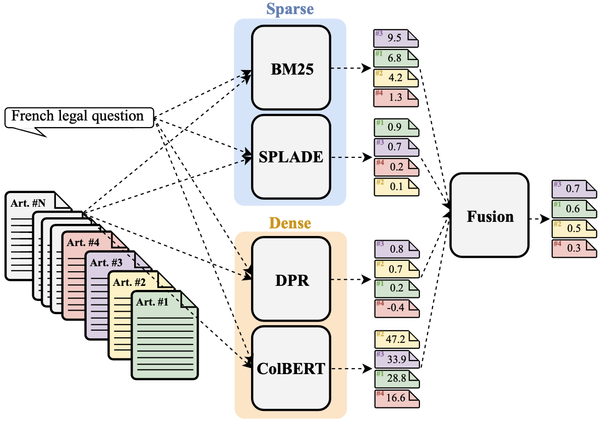

[](https://opensource.org/licenses/MIT)
[](https://www.python.org/downloads/)
[](https://arxiv.org/abs/2409.01357)
[](https://huggingface.co/collections/maastrichtlawtech/legal-neural-retrievers-65157a02cc0f7d552b6546c1)

# Hybrid Retrieval in the Legal Domain

This repository contains the code for reproducing the experimental results presented in the paper ["Know When to Fuse: Investigating Non-English Hybrid Retrieval in the Legal Domain"](https://arxiv.org/abs/2409.01357) by [Antoine Louis](https:/antoinelouis.co/work/), [Gijs van Dijck](https://www.maastrichtuniversity.nl/gijs.vandijck), and [Jerry Spanakis](https://dke.maastrichtuniversity.nl/jerry.spanakis/).



Hybrid search has emerged as an effective strategy to offset the limitations of different matching paradigms, especially in out-of-domain contexts where notable improvements in retrieval quality have been observed. However, existing research predominantly focuses on a limited set of retrieval methods, evaluated in pairs on domain-general datasets exclusively in English. In this work, we study the efficacy of hybrid search across a variety of prominent retrieval models within the unexplored field of law in the French language, assessing both zero-shot and in-domain scenarios. Our findings reveal that in a zero-shot context, fusing different domain-general models consistently enhances performance compared to using a standalone model, regardless of the fusion method. Surprisingly, when models are trained in-domain, we find that fusion generally diminishes performance relative to using the best single system, unless fusing scores with carefully tuned weights. These novel insights, among others, expand the applicability of prior findings across a new field and language, and contribute to a deeper understanding of hybrid search in non-English specialized domains.

## Documentation

### Setup

This repository is tested on Python 3.10. First, you should install a virtual environment:

```bash
python3 -m venv .venv/fusion
source .venv/fusion/bin/activate
```

Then, you can install all dependencies:

```bash
pip install -r requirements.txt
```

### Standalone retrieval

To run a standalone retrieval model, you can use the following command:

```bash
bash scripts/run_<MODEL>.sh <TASK> <DATASET> <DEVICE>
```
* `<MODEL>`: the model to use, either `bm25`, `colbert`, `dpr`, `splade`, or `monobert`;
* `<TASK>`: the task to perform, one of:
    * For BM25: `tuning` or `testing`;
    * For ColBERT: `train` or `test`;
    * For DPR: `train`, `test`, or `train+test`;
    * For SPLADE: `train`, `test`, or `train+test`;
    * For monoBERT: `train`, `test`, or `train+test`;
* `<DATASET>`: the dataset to use, either `lleqa` or `mmarco-fr`;
* `<DEVICE>` (optional): the device to use, either `cuda` or `cpu`.

### Hybrid retrieval

To run a combination of retrieval models on the [LLeQA](https://huggingface.co/datasets/maastrichtlawtech/lleqa) dataset, you can use the following command:

```bash
bash scripts/run_hybrid.sh <SPLIT> <DOMAIN> <EXPERIMENT>
```
* `<SPLIT>`: the LLeQA split to use, either `dev` or `test`;
* `<DOMAIN>`: the domain of the neural retrievers to use, either `general` (for zero-shot evaluation) or `legal` (for in-domain evaluation);
* `<EXPERIMENT>` (optional): the experiment to run, either nothing, `--tune_linear_fusion_weight`, or `--analyze_score_distributions`.

## Citation

For attribution in academic contexts, please cite this work as:

```latex
@article{louis2024know,
  author     = {Louis, Antoine and van Dijck, Gijs and Spanakis, Gerasimos},
  title      = {Know When to Fuse: Investigating Non-English Hybrid Retrieval in the Legal Domain},
  journal    = {CoRR},
  volume     = {abs/2409.01357},
  year       = {2024},
  url        = {https://arxiv.org/abs/2409.01357},
  eprinttype = {arXiv},
  eprint     = {2409.01357},
}
```

## License

This repository is MIT-licensed.